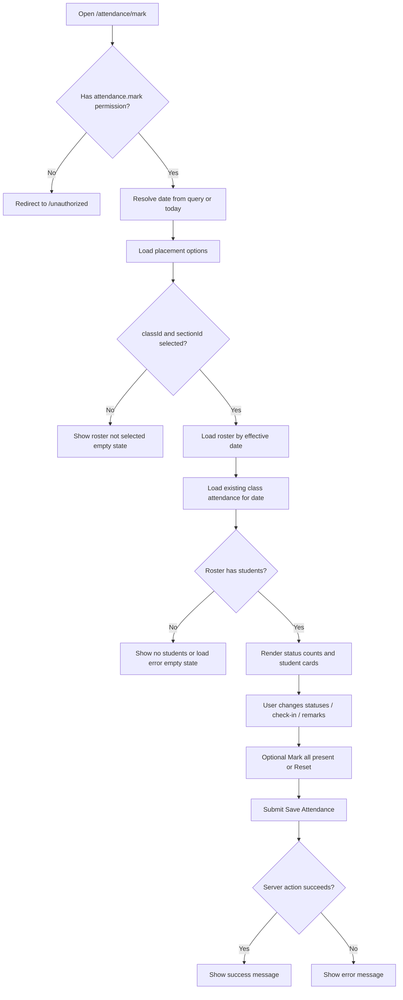

# Attendance Mark UI Documentation

Route: `http://localhost:3000/attendance/mark`

Page: `Saraswati Public School / Pune Wakad Campus / 2026-27 / Attendance / Mark`

Title: `Mark Attendance`

Description: `Mark class and section attendance for the selected date. Records are saved through the tenant-scoped attendance service.`

This document describes the current implementation only. It does not propose changes.

## A. Current Implementation

### Page Hierarchy

```text
MarkAttendancePage (Server Component)
|-- AppShell (Client Component)
|   |-- Sticky top header
|   |   |-- Mobile menu button
|   |   |-- Mobile product identity
|   |   |-- Desktop tenant summary
|   |   |-- Tenant select controls
|   |   |-- Command palette trigger
|   |   |-- Notification center
|   |   |-- Theme toggle
|   |   |-- Help button
|   |   `-- User profile menu
|   |-- Sidebar / mobile drawer
|   `-- Main content
|       |-- Mobile context card and Browse Modules button
|       `-- MarkAttendanceForm (Client Component)
|           |-- PageHeader
|           |   |-- Breadcrumbs
|           |   |-- Eyebrow
|           |   |-- H1 title
|           |   |-- Description
|           |   |-- Back to Attendance link action
|           |   `-- Muted school context card
|           |-- Attendance scope card
|           |   |-- SectionHeader
|           |   `-- Date, Class, Section fields
|           `-- Roster card
|               |-- SectionHeader
|               |-- Optional bulk actions
|               |-- Empty/error/no-selection states
|               `-- Attendance form
|                   |-- Hidden date input
|                   |-- Status count summary cards
|                   |-- Success/error message region
|                   |-- Student attendance article cards
|                   `-- Footer with roster count and Save Attendance button
```

### Source Files

- `src/app/attendance/mark/page.tsx`
- `src/app/attendance/mark/loading.tsx`
- `src/app/attendance/mark/error.tsx`
- `src/features/attendance/components/mark-attendance-form.tsx`
- `src/features/attendance/actions/attendance-actions.ts`
- `src/lib/api/attendance.ts`
- `src/features/attendance/types/attendance.ts`
- `src/features/attendance/services/attendance-rules.ts`
- `src/features/attendance/components/attendance-status-badge.tsx`
- `src/components/app-shell.tsx`
- `src/components/layout/sidebar.tsx`
- `src/components/navigation/breadcrumbs.tsx`
- `src/components/ui/index.tsx`
- `src/components/ui/button.tsx`
- `src/app/globals.css`

## B. Observed Behavior

### Route Data Loading

`MarkAttendancePage` is an async Server Component. It reads `searchParams`:

- `date`
- `classId`
- `sectionId`

If the current role lacks `attendance.mark`, the page redirects to `/unauthorized`.

The effective attendance date is:

- the `date` query parameter when it matches `YYYY-MM-DD`
- otherwise today's ISO date from `new Date().toISOString().slice(0, 10)`

The page builds a tenant scope from `tenantContext`:

- `tenantId`
- `schoolId`
- `campusId`
- `academicYearId`

It loads placement options with `studentService.getAcademicPlacements(scope)`.

If both `classId` and `sectionId` are present, it loads the roster with `studentPlacementService.getRosterByEffectiveDate(scope, { classId, sectionId, effectiveDate })`.

If roster loading throws, the error message is passed into the form as `loadError`.

If both `classId` and `sectionId` are present, it also loads existing attendance records with `attendanceService.getClassAttendance(scope, classId, sectionId, date)`.

### Query-Driven Selection

Date, class, and section changes update URL query parameters through `router.push`.

When `classId` changes, `sectionId` is removed from the URL.

The page does not use local draft state for class/date/section. Selection state is URL-backed.

### Roster Rendering

The student attendance interface is a card/list layout, not a table. Each student is rendered as an `article`.

If a class and section are selected and roster data exists, the page renders:

- hidden fields for each student
- one status `select`
- one time input for check-in
- one text input for remarks

### Save Behavior

The form submits to `markAttendanceAction` through React `useActionState`.

The save button label is `Save Attendance`.

While the action is pending, the shared `Button` renders an inline spinner and sets `aria-busy`.

On success, a green message appears with: `Attendance saved successfully.`

On error, a rose message appears with the error/fallback message.

## C. Technical Implementation Notes

### Component Ownership

| Concern | Owner |
|---|---|
| Permission check | `MarkAttendancePage` server component |
| Tenant scope | `MarkAttendancePage`, `markAttendanceAction`, `attendanceService` |
| Placement option loading | `MarkAttendancePage` |
| Roster loading | `MarkAttendancePage` |
| Existing attendance loading | `MarkAttendancePage` |
| URL updates | `MarkAttendanceForm` |
| Per-student status draft state | `MarkAttendanceForm` |
| Save mutation | `markAttendanceAction` server action |
| Persistence rules | `attendanceService.markAttendance` |
| Date policy | `validateAttendanceDatePolicy` |
| Existing status change policy | `attendanceService.markAttendance` |

### Client and Server Components

- `src/app/attendance/mark/page.tsx` is a Server Component.
- `MarkAttendanceForm` is a Client Component.
- `AppShell`, sidebar, command palette, theme toggle, notification center, and user profile are Client Components.
- `markAttendanceAction` is a Server Action declared with `"use server"`.

### Form State

`MarkAttendanceForm` uses:

- `useActionState(markAttendanceAction, initialState)` for server action lifecycle.
- `useState<Record<string, AttendanceStatus>>` for local status selection state.
- `useMemo` for status counts.
- `useRouter`, `usePathname`, and `useSearchParams` for query updates.

The `statuses` state initializes from `existingRecords`; if no existing record exists for a student, the default is `present`.

### URL State

The route accepts:

```text
/attendance/mark?date=YYYY-MM-DD&classId=<classId>&sectionId=<sectionId>
```

Changing date/class/section pushes a new URL and relies on the App Router to refetch server data.

### Validation and Business Rules

Client-side validation is minimal and mostly native:

- date input has `max={todayIsoDate()}`
- section select is disabled until a class is selected
- remarks input has `maxLength={300}`
- status select only renders known statuses

Server-side validation includes:

- permission check for `attendance.mark`
- valid attendance status for every row
- `markAttendanceSchema` parsing inside `attendanceService.markAttendance`
- date policy: future dates are rejected
- duplicate submitted student rows are rejected
- each student must resolve in tenant/campus/academic-year scope
- existing attendance status changes are rejected and require the correction workflow

## D. UX Observations

- The page is task-oriented and uses a two-card workflow: scope selection first, roster second.
- The title and context card reinforce tenant, campus, and academic year.
- The roster card remains visible even before selections are complete, showing a no-selection empty state.
- The interface favors repeated row editing through compact student cards instead of a dense table.
- Status counts update immediately when local status selects change.
- `Mark all present` is the only bulk status action.
- `Reset` restores local statuses from existing records or defaults back to `present`.
- There is no explicit unsaved-changes warning.
- There is no confirmation dialog before save.
- There is no redirect after save; the user remains on the same page.

## E. Accessibility Observations

| Area | Current Implementation | Status | Notes |
|---|---|---|---|
| Breadcrumbs | Uses `<nav aria-label="Breadcrumb">` | PASS | Items are text-only, not links. |
| Page title | H1 rendered by `PageHeader` | PASS | Title text is visible and responsive. |
| Cards/sections | `Card` renders `<section>` | PASS | Section headings are visible via `SectionHeader`. |
| Field labels | `Field` wraps children in `<label>` | PASS | Native controls receive implicit labels. |
| Required indicators | Required fields show a visual `*` with `aria-hidden` | PARTIAL | Required state is visible; controls do not receive `required` attributes. |
| Date input | Native `type="date"` with max date | PASS | Keyboard/browser behavior is native. |
| Selects | Native `<select>` controls | PASS | Keyboard behavior is native. |
| Disabled section select | `disabled={!selectedClassId}` | PASS | Disabled state is semantic. |
| Student rows | Each student is an `<article>` | PARTIAL | Good grouping, but no accessible name/heading association beyond visible text. |
| Status selection | Native select per student | PASS | Each select is labeled `Status`; visual grouping provides student context. |
| Status badges | Include `sr-only` text `Attendance status:` | PASS | Badge symbol text is hidden from AT with `aria-hidden`. |
| Success/error save message | Plain div, color-coded | PARTIAL | Message is visible, but no `role="status"` or `role="alert"`. |
| Button loading state | Button sets `aria-busy`; spinner is `aria-hidden` | PASS | Button is disabled while loading. |
| Focus styles | Global and component `focus-visible` outlines | PASS | Focus ring uses sky/primary outline. |
| Sidebar drawer | Mobile drawer uses `role="dialog"`, Escape handling, focus containment | PASS | Applies to shell, not page-specific content. |
| Color-only information | Status counts are text; badges use text labels | PASS | Status is not color-only. |
| Touch targets | Most controls are `h-9`; mobile rows stack | PARTIAL | 36px controls are below the ideal 44px target in some places. |

## F. Responsive Behavior

### Global Breakpoints and Utilities

Actual Tailwind/media behavior in use:

- default/mobile: single-column layouts
- `max-width: 479px`: `.responsive-panel` radius reduces, `.responsive-card-padding` becomes `12px`, action-row children can become full width
- `sm` (`min-width: 640px`): header grid changes, several paddings increase, roster footer switches to row layout
- `md`: attendance scope fields become 3 columns
- `lg` (`min-width: 1024px`): sidebar appears, main shell grid reserves sidebar width, PageHeader becomes two columns, student rows become four columns
- `xl` (`min-width: 1280px`): top header tenant selector gets four columns

### App Shell Responsive Behavior

Mobile and tablet below `lg`:

- Desktop sidebar is hidden.
- A sticky top header remains visible.
- Mobile menu button appears.
- A mobile context card appears above main content with breadcrumbs and `Browse Modules`.
- Main content padding: `px-3 py-4`, then `sm:px-4 sm:py-5`.

Desktop `lg` and above:

- Sidebar appears fixed below the top header.
- Expanded sidebar width is `280px`; collapsed width is `76px`.
- Main shell grid uses `lg:grid-cols-[280px_minmax(0,1fr)]` or `lg:grid-cols-[76px_minmax(0,1fr)]`.
- Main content padding is `lg:px-6 lg:py-6`.

### Page Content Responsive Behavior

The page content wrapper is `.erp-container`, with:

- width: `min(100%, 1280px)`
- centered with `margin-inline: auto`
- vertical spacing: `space-y-4 sm:space-y-5 lg:space-y-6`

### Page Header Responsive Behavior

`PageHeader`:

- default: single-column grid with gap `1rem`
- `lg`: `grid-cols-[minmax(0,1.6fr)_minmax(260px,auto)]`
- action/context area is right-aligned on `lg`
- rounded by `.responsive-panel` (`16px`, reduced to `12px` under 480px)
- padding `p-4`, `sm:p-5`

### Attendance Scope Controls

The controls are inside:

```text
grid gap-3 p-4 sm:p-5 md:grid-cols-3
```

Behavior:

- mobile/small: date, class, and section stack vertically
- `md` and above: date, class, and section sit in three equal grid columns

### Roster Summary Cards

Status count cards are inside:

```text
grid gap-3 border-b border-border p-4 sm:grid-cols-2 lg:grid-cols-6 sm:p-5
```

Behavior:

- mobile: one card per row
- `sm`: two columns
- `lg`: six columns, one for each status

### Student Rows

Each student row is an `article`:

```text
grid gap-3 rounded-lg border border-border bg-surface-muted p-3
lg:grid-cols-[minmax(180px,1fr)_minmax(180px,220px)_120px_minmax(200px,1fr)]
lg:items-end
```

Behavior:

- mobile/tablet below `lg`: student identity, status, check-in, and remarks stack vertically
- `lg` and above: four-column layout
  - student identity flexible column
  - status column 180-220px
  - check-in column 120px
  - remarks column minimum 200px, flexible

No horizontal table scroll is used because the interface is card-based.

### Roster Footer

Footer layout:

```text
flex flex-col gap-3 border-t border-border px-4 py-4
sm:flex-row sm:items-center sm:justify-between sm:px-5
```

Behavior:

- mobile: roster count and save button stack
- `sm` and above: count left, save button right

## Page Structure Details

### Application Shell

Component: `AppShell`

Purpose:

- wraps all page content in a shared ERP shell
- provides sticky top header
- provides sidebar navigation
- provides mobile drawer behavior
- provides main content padding and background

Background:

- shell: `bg-slate-100`, dark `bg-slate-950`
- text: `text-slate-950`, dark `text-slate-50`

Topbar:

- `sticky top-0 z-30`
- border bottom: `border-slate-200`, dark `border-slate-800`
- background: `bg-white/95`, dark `bg-slate-950/95`
- backdrop blur enabled
- min height: `min-h-16`

Desktop topbar identity:

- shows `Saraswati Public School`
- shows `Pune Wakad Campus / 2026-27`

Mobile topbar identity:

- shows square `SE` logo
- shows `SchoolERP OS`
- shows `Institution operations platform`

Topbar actions:

- command palette trigger
- notification center
- theme toggle
- Help button (`hidden sm:inline-flex`)
- user profile menu

Tenant selectors:

- four native/shared `Select` components
- education group, school, campus, academic year
- hidden by default
- rendered as grid from `md` upward
- `xl:grid-cols-4`

Sidebar:

- desktop sidebar fixed from `top-[65px]` to bottom
- expanded width `280px`
- collapsed width `76px`
- mobile drawer width `min(336px, 90vw)`
- mobile drawer uses overlay `bg-slate-950/45 backdrop-blur-[1px]`
- active route logic is pathname based in sidebar state resolver

Active navigation for this route:

- `Attendance` parent is active/open.
- `Mark Attendance` child is current because navigation config includes `activeMatch: ["/attendance/mark"]`.

### Breadcrumb

Component: `Breadcrumbs`

Actual items:

```text
Saraswati Public School / Pune Wakad Campus / 2026-27 / Attendance / Mark
```

Implementation:

- wrapper: `<nav aria-label="Breadcrumb">`
- layout: `flex flex-wrap items-center gap-1`
- typography: `text-xs text-slate-500`
- separator: plain `/` character, `aria-hidden="true"`
- items are non-clickable text spans
- final item uses `font-medium text-slate-700 dark:text-slate-300`

### Page Header

Component: `PageHeader`

Visible text:

- breadcrumb: `Saraswati Public School / Pune Wakad Campus / 2026-27 / Attendance / Mark`
- eyebrow: `Student Attendance`
- title: `Mark Attendance`
- description: `Mark class and section attendance for the selected date. Records are saved through the tenant-scoped attendance service.`
- action link: `Back to Attendance`
- context card labels:
  - `School`: `Saraswati Public School`
  - `Campus`: `Pune Wakad Campus`
  - `Academic Year`: `2026-27`

Layout:

- outer section with border, surface background, shadow, rounded responsive panel
- left column contains breadcrumb, eyebrow, title, description
- right column contains action area and context card
- context card uses `Card variant="muted"` and `responsive-card-padding`

Back link:

- Next `Link`
- href: `/attendance?date=${date}&classId=...&sectionId=...`
- height `h-9`
- rounded `rounded-lg`
- border `border-border`
- surface background
- hover `bg-surface-muted`
- focus ring `focus-visible:outline-sky-700`

## Attendance Selection Controls

Container:

- `Card`
- `SectionHeader` with eyebrow `Attendance scope`, title `Date, Class & Section`
- control grid: `grid gap-3 p-4 sm:p-5 md:grid-cols-3`

### Attendance Date

Label: `Attendance date`

Required marker: visible `*`

Helper text: `Today and past dates are supported in Stage 9.`

Control:

- native `<input type="date">`
- value: current valid date from query or today
- max: today's ISO date from client-side `todayIsoDate()`
- on change: updates `date` query parameter

Classes:

- `h-9`
- `rounded-lg`
- `border border-border`
- `bg-surface`
- `px-3`
- `text-sm text-foreground`
- `outline-none`
- focus: `focus:border-primary focus:ring-2 focus:ring-sky-100 dark:focus:ring-sky-950`

Validation:

- browser enforces date input format
- browser receives max date
- server action rejects future dates through attendance date policy

### Class

Label: `Class`

Required marker: visible `*`

Control:

- shared `Select`, native `<select>`
- default/empty option: `Select class`
- options derived by de-duplicating placement options by `classId` and `className`
- value: `selectedClassId ?? ""`
- on change: updates `classId` query parameter and clears `sectionId`

Classes from shared `Select`:

- `h-9`
- `min-w-0`
- `rounded-lg`
- `border border-border`
- `bg-surface`
- `px-3`
- `text-sm text-foreground`
- focus ring as above
- disabled style supported, though class select itself is not disabled here

### Section

Label: `Section`

Required marker: visible `*`

Control:

- shared `Select`
- default/empty option: `Select section`
- options derived from placements filtered by selected class
- value: `selectedSectionId ?? ""`
- disabled until `selectedClassId` exists
- on change: updates `sectionId` query parameter

Dependency:

```text
Class -> Section -> Roster
```

Selecting class filters the section options and clears the old section selection.

## Student List / Attendance Area

The student attendance interface is a stacked card list, not a table.

### Roster Card Header

Component: `SectionHeader`

Eyebrow: `Roster`

Title:

- if class and section names are known: `<Class Name> / Section <Section Name>`
- otherwise: `Select a class and section`

Actions, only when `roster.length > 0`:

- `Mark all present`
- `Reset`

### No Selection State

Condition:

```ts
!selectedClassId || !selectedSectionId
```

Rendered content:

- `EmptyState`
- title: `Roster not selected`
- description: `Choose a class and section to load the tenant-scoped student roster.`

### Empty Roster State

Condition:

```ts
selectedClassId && selectedSectionId && roster.length === 0 && !loadError
```

Rendered content:

- `EmptyState`
- title: `No students found`
- description: `No current students were found for this class and section in the active academic year.`

### Roster Load Error State

Condition:

```ts
selectedClassId && selectedSectionId && roster.length === 0 && loadError
```

Rendered content:

- `EmptyState`
- title: `Roster could not be loaded`
- description: server-side load error string

### Student Card Fields

Each student card displays:

| Field | Implementation | Text/Value |
|---|---|---|
| Student name | `<p>` | `student.displayName` |
| Admission number | `<p>` with mono font | `student.admissionNumber` |
| Roll number | `<p>` | `Roll ${student.rollNumber}` or `Roll not assigned` |
| Existing status badge | `AttendanceStatusBadge` | only shown when existing attendance record exists |
| Status control | `Select` | one of six attendance statuses |
| Check-in control | native `input type="time"` | existing `checkInTime` or empty |
| Remarks control | native text input | existing `remarks` or empty |

Hidden inputs per row:

- `studentId`
- `classId:<studentId>`
- `sectionId:<studentId>`

### Student Card Styling

Class list:

```text
grid gap-3 rounded-lg border border-border bg-surface-muted p-3
lg:grid-cols-[minmax(180px,1fr)_minmax(180px,220px)_120px_minmax(200px,1fr)]
lg:items-end
```

Typography:

- name: `font-semibold text-foreground`
- admission: `font-mono text-xs text-foreground-muted`
- roll: `text-xs text-foreground-muted`

## Attendance Status UI

Statuses are defined in `attendanceStatuses`:

- `present` -> `Present`
- `absent` -> `Absent`
- `late` -> `Late`
- `excused` -> `Excused`
- `half_day` -> `Half-day`
- `leave` -> `Leave`

Status selection:

- rendered as a native `<select>`
- one select per student
- exactly one status per student
- default is existing record status, otherwise `present`
- changes update local React `statuses` state immediately
- save is required to persist changes

Status counts:

- displayed above student rows in six summary cards
- one card per status
- label uses `getAttendanceStatusLabel`
- count uses local `statuses`
- updates immediately as status selects change

Existing status badge:

- rendered only if an existing attendance record is present for that student
- component: `AttendanceStatusBadge`
- uses `Badge`
- includes a short visible symbol:
  - Present: `OK`
  - Absent: `No`
  - Late: `Late`
  - Excused: `Exc`
  - Half-day: `Half`
  - Leave: `Leave`
- includes screen-reader prefix: `Attendance status:`

Badge tones:

- Present: success
- Absent: danger
- Late: warning
- Half-day: warning
- Excused: info
- Leave: info

There are no custom status icons in the attendance row controls.

## Check-In

Check-in exists.

Implementation:

- native `<input type="time">`
- name: `checkInTime:<studentId>`
- default value: `existing?.checkInTime ?? ""`
- no placeholder
- no explicit required state
- no visible helper text
- no inline validation message

Classes:

- `h-9`
- `rounded-lg`
- `border border-border`
- `bg-surface`
- `px-3`
- `text-sm text-foreground`
- focus ring matching date input

Check-out is supported by the server action (`checkOutTime:<studentId>`) but no check-out UI field is rendered on this page.

## Remarks

Remarks exists.

Implementation:

- native text `<input>`
- name: `remarks:<studentId>`
- placeholder: `Optional remark`
- default value: `existing?.remarks ?? ""`
- max length: `300`
- optional
- no visible character counter
- no inline validation message

Classes match check-in/date inputs.

## Bulk / Quick Attendance Actions

Bulk actions render only when `roster.length > 0`.

### Mark all present

Component: `Button`

Variant: `secondary`

Label: `Mark all present`

Location: roster `SectionHeader` action area.

Behavior:

- sets every roster student's local status to `present`
- does not submit immediately
- does not show confirmation
- no undo beyond `Reset`
- enabled whenever roster exists

### Reset

Component: `Button`

Variant: `ghost`

Label: `Reset`

Behavior:

- resets each local status to existing attendance record status when present
- otherwise resets status to `present`
- does not reset check-in or remarks fields because those are uncontrolled inputs with default values
- does not submit immediately

No other bulk actions are implemented.

## Save / Submit Workflow

Save button:

- component: shared `Button`
- label: `Save Attendance`
- type: `submit`
- variant: default `primary`
- location: bottom-right of roster form footer on `sm` and above; stacked below roster count on mobile
- loading: `loading={pending}`

Form submission includes:

- date
- repeated `studentId` values
- per-student class ID
- per-student section ID
- per-student status
- per-student check-in time
- per-student remarks

Server action:

- `markAttendanceAction`
- permission check for `attendance.mark`
- validates statuses
- calls `attendanceService.markAttendance`
- revalidates:
  - `/attendance`
  - `/attendance/mark`
  - each affected `/students/<studentId>`

Success state:

- green/emerald message box
- message: `Attendance saved successfully.`

Error state:

- rose message box
- message from `ApiError` or fallback

Duplicate-save prevention:

- while pending, `Button` disables itself because `loading` makes `isDisabled` true.

Navigation after save:

- no redirect
- remains on the current page

## States

### Initial State

When no query parameters are present:

- date defaults to today
- class select shows `Select class`
- section select shows `Select section` and is disabled
- roster card title is `Select a class and section`
- empty state says `Roster not selected`
- no form is rendered
- no save button is rendered

### Loading State

Route-level `loading.tsx` renders:

- AppShell
- `.erp-container`
- `PageHeader` with:
  - eyebrow `Student Attendance`
  - title `Mark Attendance`
  - description `Loading the attendance roster.`
- first `Card` with `Skeleton h-24 w-full`
- second `Card` with `Skeleton h-96 w-full`

Skeleton styling:

- `animate-pulse`
- `rounded-lg`
- `bg-slate-200`
- dark `bg-slate-800`

### Empty State

If selected class/section has no current students:

- title: `No students found`
- description: `No current students were found for this class and section in the active academic year.`

### No Selection State

Before class and section are selected:

- title: `Roster not selected`
- description: `Choose a class and section to load the tenant-scoped student roster.`

### Error State

Route-level `error.tsx` renders:

- AppShell
- centered card `mx-auto max-w-xl`
- `SectionHeader` eyebrow `Student Attendance`, title `Unable to load roster`
- `EmptyState`
  - title `Roster unavailable`
  - description `The attendance-taking workspace could not be loaded. Retry or ask an administrator to review access.`
- secondary `Retry` button that calls `reset`

Roster-level load errors render inside the roster card as an `EmptyState`.

### Validation Error

Validation errors from save are shown as a rose alert-style message box inside the form above student cards.

Examples include:

- invalid attendance status
- future date rejected
- existing attendance status changes requiring correction workflow
- duplicate student rows
- student outside scope

### Saving State

While pending:

- `Save Attendance` button is disabled
- button shows spinner before its children
- button has `aria-busy`

### Success State

After save:

- green/emerald message box appears above the student card list
- text: `Attendance saved successfully.`

### Permission / Unauthorized State

If role lacks `attendance.mark`, `MarkAttendancePage` redirects to `/unauthorized`.

## Visual Design System

### Colors

CSS tokens in `globals.css`:

| Token | Light | Dark |
|---|---|---|
| `--background` | `#f1f5f9` | `#020617` |
| `--foreground` | `#0f172a` | `#f8fafc` |
| `--foreground-muted` | `#64748b` | `#94a3b8` |
| `--surface` | `#ffffff` | `#020617` |
| `--surface-elevated` | `#ffffff` | `#0f172a` |
| `--surface-muted` | `#f8fafc` | `#0f172a` |
| `--border` | `#e2e8f0` | `#1e293b` |
| `--border-strong` | `#cbd5e1` | `#334155` |
| `--primary` | `#0369a1` | `#0284c7` |
| `--primary-foreground` | `#ffffff` | `#f8fafc` |
| `--success` | `#047857` | same token value |
| `--warning` | `#b45309` | same token value |
| `--danger` | `#be123c` | same token value |
| `--info` | `#1d4ed8` | same token value |

Status message colors:

- success: emerald border/background/text
- error: rose border/background/text

Badge colors:

- success: emerald
- warning: amber
- danger: rose
- info: blue
- neutral: slate

### Typography

Global font:

```text
Inter, ui-sans-serif, system-ui, -apple-system, BlinkMacSystemFont, "Segoe UI", sans-serif
```

Monospace:

```text
"SFMono-Regular", Consolas, "Liberation Mono", monospace
```

Page header:

- eyebrow: `text-sm font-semibold text-primary`
- H1: `text-2xl sm:text-3xl font-semibold tracking-tight`
- description: `text-sm leading-6 text-foreground-muted`

Section header:

- eyebrow: `text-xs font-semibold uppercase tracking-wide text-primary`
- title: `text-lg font-semibold text-foreground`

Student card:

- name: `font-semibold`
- admission number: `font-mono text-xs`
- roll text: `text-xs`

### Spacing

Page:

- shell main: `px-3 py-4 sm:px-4 sm:py-5 lg:px-6 lg:py-6`
- content stack: `space-y-4 sm:space-y-5 lg:space-y-6`
- cards: generally `p-4 sm:p-5` for inner content
- roster card list: `grid gap-3 p-3 sm:p-5`
- student card: `gap-3 p-3`

### Shape

Tokens:

- control radius: `8px`
- card radius: `12px`
- panel radius: `16px`

Actual classes:

- cards: `rounded-xl`
- controls/buttons: `rounded-lg`
- badges: `rounded-md`
- empty state: `rounded-lg`

### Shadows

Tokens:

- `--shadow-level-1`: `0 1px 2px rgb(15 23 42 / 0.06)`
- `--shadow-level-2`: `0 8px 24px rgb(15 23 42 / 0.10)`

Cards:

- default card uses `shadow-sm`
- elevated variant can use `shadow-[var(--shadow-level-2)]`, but this page mostly uses default and muted cards

### Borders

- cards: `border border-border`
- section headers: `border-b border-border`
- student rows: `border border-border`
- empty state: `border border-dashed border-border-strong`
- form footer: `border-t border-border`

## Iconography

No attendance-specific icons are used inside the main Mark Attendance form.

Shell icons are custom inline SVGs from `src/components/layout/sidebar-icons.tsx`, not an external icon package:

| Icon | Location | Purpose | Size |
|---|---|---|---|
| `MenuIcon` | mobile topbar, mobile context card | open navigation | `h-4 w-4` |
| `CloseIcon` | mobile drawer | close navigation | `h-4 w-4` |
| `PanelToggleIcon` | desktop sidebar | collapse/expand sidebar | `h-4 w-4` |
| `SidebarIcon("attendance")` | sidebar Attendance item | attendance navigation | `h-4.5 w-4.5` |
| `ChevronIcon` | sidebar groups | expand/collapse indication | `h-4 w-4` |

Attendance status badges use text symbols, not icons.

## Component Inventory

| UI Element | Component | Source File | Purpose | Reusable |
|---|---|---|---|---|
| Route page | `MarkAttendancePage` | `src/app/attendance/mark/page.tsx` | Server data loading and permission gate | No, route-specific |
| Loading page | `MarkAttendanceLoading` | `src/app/attendance/mark/loading.tsx` | Route loading skeleton UI | No, route-specific |
| Error page | `MarkAttendanceError` | `src/app/attendance/mark/error.tsx` | Route error fallback | No, route-specific |
| App shell | `AppShell` | `src/components/app-shell.tsx` | Global ERP frame | Yes |
| Sidebar | `Sidebar` | `src/components/layout/sidebar.tsx` | Primary navigation | Yes |
| Breadcrumbs | `Breadcrumbs` | `src/components/navigation/breadcrumbs.tsx` | Breadcrumb trail | Yes |
| Page header | `PageHeader` | `src/components/ui/index.tsx` | Hero/header panel | Yes |
| Section header | `SectionHeader` | `src/components/ui/index.tsx` | Card section heading/action layout | Yes |
| Card | `Card` | `src/components/ui/index.tsx` | Surface container | Yes |
| Field | `Field` | `src/components/ui/index.tsx` | Label/helper/error wrapper | Yes |
| Select | `Select` | `src/components/ui/index.tsx` | Styled native select | Yes |
| Button | `Button` | `src/components/ui/button.tsx` | Styled button with loading | Yes |
| Empty state | `EmptyState` | `src/components/ui/index.tsx` | Dashed empty/error panel | Yes |
| Skeleton | `Skeleton` | `src/components/shared/skeleton.tsx` | Loading placeholder | Yes |
| Main form | `MarkAttendanceForm` | `src/features/attendance/components/mark-attendance-form.tsx` | Attendance marking UI | Attendance-specific |
| Status badge | `AttendanceStatusBadge` | `src/features/attendance/components/attendance-status-badge.tsx` | Existing status display | Attendance-specific |
| Save action | `markAttendanceAction` | `src/features/attendance/actions/attendance-actions.ts` | Server action mutation | Attendance-specific |

No shadcn/ui or Radix primitives are used directly in this page. The UI primitives are custom project components.

## UX Flow



## Recreate Checklist

To recreate the current UI visually and behaviorally:

1. Wrap the page in `AppShell`.
2. Use `.erp-container` with `space-y-4 sm:space-y-5 lg:space-y-6`.
3. Render `PageHeader` with breadcrumb, eyebrow `Student Attendance`, H1 `Mark Attendance`, description, action link, and context card.
4. Render an attendance scope `Card` with `SectionHeader` and three controls: date, class select, section select.
5. Use URL query params as the source for date/class/section.
6. Render a roster `Card` with conditional bulk actions.
7. Render empty states until class/section and roster are available.
8. Render status summary cards for all six attendance statuses.
9. Render each student as a responsive `article`, not a table row.
10. Use native selects/time/text inputs.
11. Submit through `markAttendanceAction`.
12. Show success/error action state messages above the student card list.
13. Put roster count and primary `Save Attendance` button in the form footer.

